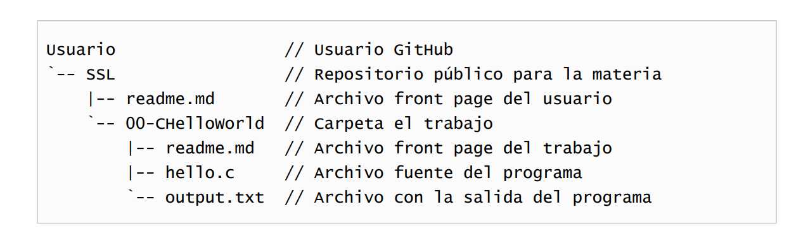

# Trabajo Práctico 3 – Hello, World! en C

## ✅ Objetivos

- Compilar y ejecutar un programa en lenguaje C (versión C23).
- Utilizar un sistema de control de versiones (GitHub).
- Documentar el uso del compilador.
- Preparar el entorno de trabajo y publicar los resultados.

---

## 🧩 Estructura del Repositorio



## 🪪 Paso 1 – Cuenta en GitHub

1. Crear cuenta en [GitHub](https://github.com).
2. Ir a **Settings > Emails**:
   - Agregar el email `@frba.utn.edu.ar`.
   - Verificarlo.
   - Marcarlo como **público** temporalmente.

---

## 🗂️ Paso 2 – Crear repositorio público

1. Crear un repositorio llamado `SSL` (público).
2. Agregar un archivo `readme.md` con esta estructura inicial:

```markdown
# Carlos Boyatjian – SSL

Repositorio personal para la materia Sistemas y Software de Laboratorio (SSL), UTN FRBA.

## Trabajo

// hello.c
```

#include <stdio.h>

int main(void) {
    printf("Hello, World!\n");
    return 0;
}

```


### En la consola de WSL
Verificar versión de GCC: 
gcc --version

Debe mostrar algo como:
gcc (Ubuntu 13.1.0)

Compilar usando C23:
gcc -std=c23 hello.c -o hello


Ejecutar normalmente:
./hello

Redireccionar salida a un archivo:
./hello > output.txt

Verificar contenido del archivo:
cat output.txt